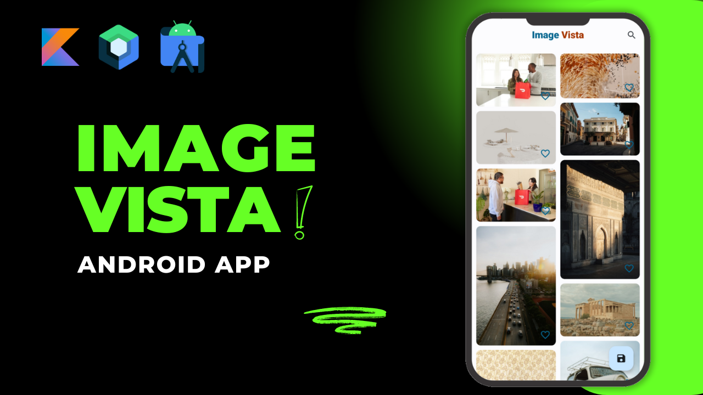
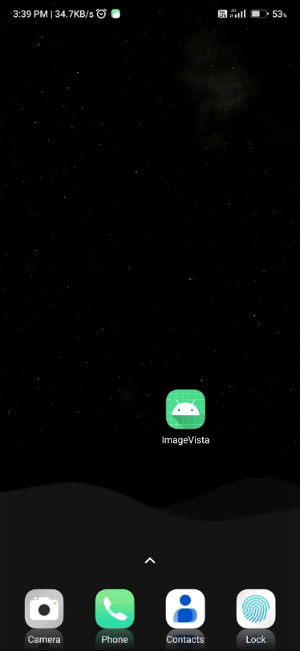

<h1 align = "center">
<b><i>Image Vista Android App</i></b>
</h1>

Welcome to the Image Vista Android App repository. We will build an amazing Android application that showcases beautiful images from the Unsplash API. We'll be using a range of powerful libraries and frameworks to build our app.

# :building_construction: Tech Stack :building_construction:

- **Jetpack Compose:** To build the User Interface
- **Material 3:** To Design a beautiful and consistent UI.
- **Splash Screen:** To create a captivating splash screen for our app.
- **Paging 3:** To Implement efficient and smooth infinite scrolling.
- **Coil:** To Load and display images effortlessly.
- **Dagger Hilt:** To Manage dependency injection for cleaner, modular code.
- **Compose Navigation:** To Navigate between screens seamlessly.
- **Retrofit:** To Make network requests and handle API responses.
- **Room:** To Store and manage local data.

# :camera_flash: **Screenshots** :camera_flash:

| Main Feed Screen                  | Search Screen                     | Bookmarks Screen                  |
|-----------------------------------|-----------------------------------|-----------------------------------|
|  |   |  |
| Profile (WebView)                 | Splash Screen                     | Preview Image                     | 
|  |   |  |
| Zoom Image                        | Download Image                    | Dark Mode                         |
|  |   |  |

# :hammer_and_wrench: Youtube Playlist :hammer_and_wrench:

🎥 All videos can be found here [YouTube Course Playlist](https://youtube.com/playlist?list=PL1b73-6UjePBns1mFhHNhZvIUXEFNdd8c&si=1xu29HdLqcZJ_RW-).

# :memo: Authors :memo:
- [Mohammad Arif](https://github.com/CodeInKotLang)

Check out my Udemy online course: [MeasureMate Android App](https://www.udemy.com/course/measuremate/?referralCode=B3DE352F96BC3C3E9E80)

Happy learning and building amazing Android apps!
